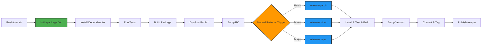

# @budgetbuddyde/api

## About


A type-safe, Zod-validated API client for BudgetBuddy backend services. This package provides a unified interface for communicating with all backend endpoints and offers runtime validation as well as full TypeScript support.

## Features 
- 
- Automatic Zod validation of all responses
- Type-safe request/response handling
- Query parameter serialization
- Error handling and error types
- Request config merging

## Getting Started

### Installation

Install the package using your preferred package manager:

```bash
npm install @budgetbuddy/api
```

### Start Development

To start developing this package locally:

```bash
# Navigate to the package directory
cd packages/api

# Install dependencies
npm install

# Run in development mode
npm run dev
```

### Build Package

To build the package for production:

```bash
# Build the package
npm run build

# Run tests
npm run test
```

## Usage

```typescript
import { Api } from '@budgetbuddyde/api';

// Initialize API client
const api = new Api('https://backend.budgetbuddy.de');

// Fetch transactions
const [transactions, error] = await api.backend.transaction.getAll();

if (error) {
  console.error('Error loading transactions:', error);
  return;
}

console.log('Transactions:', transactions);
```

### CRUD Operations

All entity services provide standard CRUD operations:

```typescript
// Create - Create new category
const [newCategory, createError] = await api.backend.category.create({
  name: 'Groceries',
  description: 'Supermarket purchases',
});

// Read - Fetch all categories
const [categories, getAllError] = await api.backend.category.getAll();

// Read - Fetch single category
const [category, getError] = await api.backend.category.getById('category-id');

// Update - Update category
const [updated, updateError] = await api.backend.category.updateById(
  'category-id',
  { name: 'Groceries & Beverages' }
);

// Delete - Delete category
const [deleted, deleteError] = await api.backend.category.deleteById('category-id');
```

### Query Parameters

Many endpoints support query parameters for filtering and pagination:

```typescript
// Fetch transactions with date filter
const [transactions, error] = await api.backend.transaction.getAll({
  startDate: new Date('2024-01-01'),
  endDate: new Date('2024-12-31'),
  limit: 50,
  offset: 0,
});
```


### Error Handling

The package uses a `TResult<T, E>` pattern for type-safe error handling:

```typescript
import type { TResult } from '@budgetbuddyde/api';

async function loadBudgets() {
  const [budgets, error] = await api.backend.budget.getAll();
  
  // Check for errors
  if (error) {
    // TypeScript knows that 'budgets' is null here
    if (error instanceof BackendError) {
      console.error('Backend error:', error.statusCode, error.message);
    } else if (error instanceof NetworkError) {
      console.error('Network error:', error.message);
    }
    return;
  }
  
  // TypeScript knows that 'budgets' is not null here
  console.log('Budgets loaded:', budgets);
}
```

### Custom Request Configuration

For advanced usage, request options can be passed:

```typescript
// With custom headers
const [data, error] = await api.backend.transaction.getAll(
  undefined,
  {
    headers: {
      'X-Custom-Header': 'value',
    },
    signal: abortController.signal, // AbortController for cancellation
  }
);
```

### Common Methods

All services inherit from `EntityService` and provide:

```typescript
// Type signature simplified
class EntityService<CreatePayload, UpdatePayload, ...> {
  getAll<Q>(query?: Q, config?: RequestInit): Promise<TResult<GetAllResult>>;
  getById(id: string, config?: RequestInit): Promise<TResult<GetResult>>;
  create(payload: CreatePayload, config?: RequestInit): Promise<TResult<CreateResult>>;
  updateById(id: string, payload: UpdatePayload, config?: RequestInit): Promise<TResult<UpdateResult>>;
  deleteById(id: string, config?: RequestInit): Promise<TResult<DeleteResult>>;
}
```

## API

### Available Services

| Service                        | Description         | Endpoint                |
|--------------------------------|---------------------|-------------------------|
| `api.backend.category`         | Category management | `/api/category`         |
| `api.backend.paymentMethod`    | Payment methods     | `/api/paymentMethod`    |
| `api.backend.transaction`      | Transactions        | `/api/transaction`      |
| `api.backend.recurringPayment` | Recurring payments  | `/api/recurringPayment` |
| `api.backend.budget`           | Budget management   | `/api/budget`           |

### Type Safety

The package leverages Zod for runtime validation combined with TypeScript for compile-time safety:

```typescript
// Schema defines both runtime and compile-time types
const CategorySchema = z.object({
  id: z.string(),
  name: z.string(),
});

// TypeScript type is derived from schema
type TCategory = z.infer<typeof CategorySchema>;

// Runtime validation in services
const parsingResult = CategorySchema.safeParse(apiResponse);
if (!parsingResult.success) {
  // Handle validation errors
}
```

### Architecture Components

#### API Class (`api.ts`)

The central entry point that aggregates all service instances:

```typescript
const api = new Api('https://backend-url');
// Access all services:
// - api.backend.category
// - api.backend.paymentMethod
// - api.backend.transaction
// - api.backend.recurringPayment
// - api.backend.budget
```

#### Entity Service (`services/entity.service.ts`)

Abstract base class for all entity services with generic CRUD operations:

- `getAll(query?, config?)` - Fetch all entities
- `getById(id, config?)` - Fetch single entity
- `create(payload, config?)` - Create new entity
- `updateById(id, payload, config?)` - Update entity
- `deleteById(id, config?)` - Delete entity

#### Specialized Services (`services/*.service.ts`)

Extend `EntityService` with domain-specific methods:

```typescript
// Example: BudgetService with additional method
class BudgetService extends EntityService {
  async getEstimatedBudget(): Promise<TResult<TEstimatedBudget>> {
    // Budget-specific logic
  }
}
```

#### Type System (`types/`)

##### Schemas (`types/schemas/`)

Zod schemas for runtime validation:

```typescript
import { z } from 'zod';

export const CategorySchema = z.object({
  id: z.string(),
  name: z.string(),
  description: z.string().optional(),
  createdAt: z.string().datetime(),
});

export const GetAllCategoriesResponse = z.object({
  data: z.array(CategorySchema),
  total: z.number(),
});
```

##### Types (`types/*.type.ts`)
TypeScript types, often derived from Zod schemas:

```typescript
import type { z } from 'zod';
import { CategorySchema } from './schemas/category.schema';

export type TCategory = z.infer<typeof CategorySchema>;
```

##### Common Types (`types/common.ts`)

Shared type helpers:

- `TResult<T, E>` - Result type for error handling
- `TApiResponse<Schema>` - API response helper
- `TypeOfSchema<Schema>` - Schema-to-type converter

##### Interfaces (`types/interfaces/`)

TypeScript interfaces for structure definitions:

```typescript
export interface IBaseGetAllQuery {
  limit?: number;
  offset?: number;
  sortBy?: string;
  sortOrder?: 'asc' | 'desc';
}
```

#### Error Handling (`error.ts`)

Custom error classes for various error scenarios:

- `CustomError` - Base error class
- `ApiError` - General API errors
- `BackendError` - HTTP status errors from backend
- `ResponseNotJsonError` - Response is not valid JSON

```typescript
try {
  const response = await fetch(url);
  if (!response.ok) {
    throw new BackendError(response.status, response.statusText);
  }
} catch (error) {
  if (error instanceof BackendError) {
    console.error('Backend returned:', error.statusCode);
  }
}
```


## Deployment

This package is automatically built, tested, and published through our [Concourse CI/CD](https://ci.tklein.it) pipeline.



## Credits

Developed and maintained by the [BudgetBuddy team](https://github.com/orgs/BudgetBuddyDE/people).
