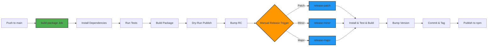

# @budgetbuddyde/db

## About


Brief description of what this package does and its purpose within the BudgetBuddy ecosystem.

**Key Features:**

- Feature 1
- Feature 2
- Feature 3

## Getting Started

### Installation

Install the package using your preferred package manager:

```bash
npm install @budgetbuddy/db
```

### Start Development

To start developing this package locally:

```bash
# Navigate to the package directory
cd packages/db

# Install dependencies
npm install

# Run in development mode
npm run dev
```

### Build Package

To build the package for production:

```bash
# Build the package
npm run build

# Run tests
npm run test
```

## Deployment

This package is automatically built, tested, and published through our [Concourse CI/CD](https://ci.tklein.it) pipeline.



## Credits

Developed and maintained by the [BudgetBuddy team](https://github.com/orgs/BudgetBuddyDE/people).
