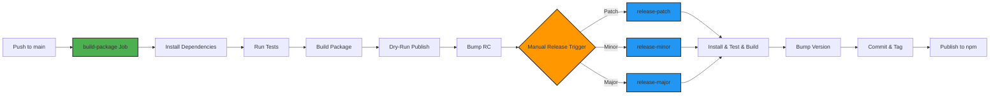

## About


A collection of utility functions, configurations, and formatters for Winston loggers used within the BudgetBuddy project.

## Features

- **Log Level Utilities**: Helper functions for parsing and validating log levels from environment variables
- **Console Format Builder**: Pre-configured Winston formatters for consistent console output
- **Level Padding**: Formatting for uniform level output in logs
- **Level Configuration**: Standardized log level configuration with colors for the entire project
- **TypeScript Support**: Fully typed with comprehensive type definitions
- **Winston Integration**: Seamless integration with Winston for all services and apps

## Getting Started

### Installation

Install the package using your preferred package manager:

```bash
npm install @budgetbuddy/logger
```

### Start Development

To start developing this package locally:

```bash
# Navigate to the package directory
cd packages/logger

# Install dependencies
npm install

# Run in development mode
npm run dev
```

### Build Package

To build the package for production:

```bash
# Build the package
npm run build

# Run tests
npm run test
```

### How to use

The logger package is used across all services (Backend, Auth-Service) and apps (WebApp) in the BudgetBuddy project to ensure consistent logging configuration and formatting.

```typescript
import { createLogger, format } from 'winston';
import { buildConsoleFormat, padLevel, LevelConfig } from '@budgetbuddyde/logger';

export const logger = createLogger({
  levels: LevelConfig.levels,
  level: config.log.level,
  format: format.combine(
    format.timestamp({ format: 'YYYY-MM-DD HH:mm:ss' }),
    format.splat(),
    padLevel(5),
    format.colorize({ level: true, colors: LevelConfig.colors }),
    buildConsoleFormat(config.service, config.log.hideMeta)
  ),
  transports: config.log.transports,
});
```

#### Log Level from Environment Variables

```typescript
import { getLogLevel } from '@budgetbuddyde/logger';

const logLevel = getLogLevel(process.env.LOG_LEVEL); // 'info', 'debug', 'warn', etc.
```

#### Winston Logger with Custom Format

```typescript
import { createLogger, format, transports } from 'winston';
import { buildConsoleFormat, padLevel, LevelConfig } from '@budgetbuddyde/logger';

const logger = createLogger({
  levels: LevelConfig.levels,
  level: getLogLevel(process.env.LOG_LEVEL),
  format: format.combine(
    format.timestamp({ format: 'YYYY-MM-DD HH:mm:ss' }),
    format.splat(),
    padLevel(5), // Pads level to 5 characters
    format.colorize({ level: true, colors: LevelConfig.colors }),
    buildConsoleFormat('MyService', false) // Show service name and meta
  ),
  transports: [new transports.Console()],
});

logger.info('Application started');
logger.warn('This is a warning');
logger.error('An error occurred');
```

## Deployment

This package is automatically built, tested, and published through our [Concourse CI/CD](https://ci.tklein.it) pipeline.



## Credits

Developed and maintained by the [BudgetBuddy team](https://github.com/orgs/BudgetBuddyDE/people).
