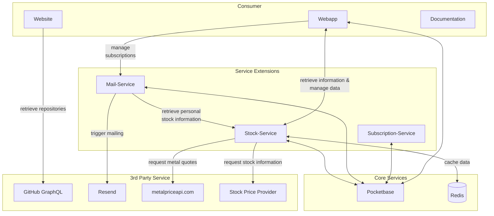

# Services

```mermaid
flowchart TD

website[Website]
webapp[Webapp]
docs[Documentation]
pocketbase[Pocketbase]
stockService[Stock-Service]
mailService[Mail-Service]
subscriptionService[Subscription-Service]
redis[(Redis)]
github[GitHub GraphQL]
resend[Resend]
metalPrices[metalpriceapi.com]
stockPrices[Stock Price Provider]

subgraph "Core Services"
  pocketbase
  redis
end

subgraph "3rd Party Service"
  stockPrices
  metalPrices
  resend
  github
end

subgraph "Service Extensions"
  stockService<-->pocketbase
  stockService<-- cache data -->redis
  stockService-- request stock information -->stockPrices
  stockService-- request metal quotes -->metalPrices
  mailService-- trigger mailing -->resend
  mailService<-->pocketbase
  mailService-- retrieve personal\nstock information -->stockService
  subscriptionService<-->pocketbase
end

subgraph "Consumer"
  website-- retrieve repositories -->github
  webapp<-->pocketbase
  webapp-- manage\nsubscriptions -->mailService
  webapp<-- retrieve information &\n manage data -->stockService
  docs
end
```
