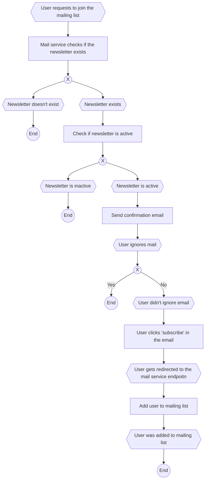

## Overview

The Mail-Service is based on [React-Email](https://react.email) and [Resend](https://resend.com), and uses [Bun](https://bun.sh) as the underlying framework. In the future, the service will be rebuilt as a native solution without relying on an external SaaS, in order to prevent dependency on external providers and to avoid sharing data with Resend.

## Getting started

<Steps>
   <Step>
      ### 1. Clone the repo

      ```bash
      git clone git@github.com/BudgetBuddyDE/BudgetBuddyDE.git
      cd services/mail-service
      ```

   </Step>
   
   <Step>
      ### 2. Install required dependencies

      ```bash
      npm install
      ```

   </Step>

   <Step>
      ### 3. Set all required environment variables

      ```bash
      cp .env.example .env
      ```

      Adjust the values in the `.env` file according to your setup.

   </Step>

   <Step>
      ### 4. Start the application

      ```bash
      bun run dev
      ```

   </Step>

   <Step>
      ### 5. _(Optional)_ Execute a compiled binary

      ```bash
      # Compile to binary
      bun build ./src/server.ts --compile --outfile cli
      # Execute binary
      ./cli
      ```

   </Step>
</Steps>

## Templating

<Steps>
   <Step>
      ### 1. Start the `react-email` server

      ```bash
      bun run email:dev
      ```

   </Step>

   <Step>
      ### 2. Edit the templates in the `transactional/email` folder
   </Step>
</Steps>

## Processes

### Opt-in


